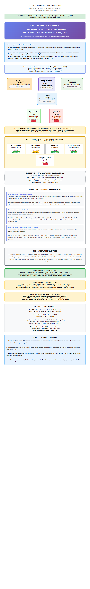

# Data Breach Disclosure Timing and Market Reactions

## Dissertation Analysis Project

**Author:** Timothy Spivey
**Institution:** University of South Alabama
**Completion Date:** January 2026

---

## 📋 Project Overview

This dissertation analyzes the market reactions to data breach disclosures among publicly-traded companies. Using a dataset of 1,054 breaches from 2000-2024, the project investigates how disclosure timing, regulatory status, and breach characteristics influence cumulative abnormal returns (CAR) and information asymmetry (measured by volatility).

### Research Questions

- **Essay 1 (Theory):** Theoretical framework for information asymmetry and disclosure
- **Essay 2 (Event Study):** Do disclosure timing and FCC regulation affect stock market reactions?
- **Essay 3 (Information Asymmetry):** Does immediate disclosure reduce volatility? Do governance factors moderate this effect?

### Sample Overview

**Total Breaches Analyzed:** 1,054 publicly-traded companies (2004-2024)
- **Essay 2 (Event Study):** 757 breaches with CRSP stock price data (72%)
- **Essay 3 (Volatility Analysis):** 750 breaches with trading data (71%)
- **Data Matching Success:** 92.1% of 858 raw breach records matched to public companies

**Breach Characteristics:**
- **FCC-Regulated Firms:** 200 (18.9%) - Telecom, cable, satellite, VoIP industries
- **Non-FCC Firms:** 854 (81.1%)
- **Repeat Offenders:** 708 (67.2%) - firms with prior breach history
- **First-Time Breaches:** 346 (32.8%)
- **Health Data Breaches:** 106 (10.1%) - Protected health information
- **Financial Data Breaches:** 231 (21.9%)
- **Executive Turnover:** 451 breaches (42.8%) with executive departure within 30 days

## 📊 Dissertation Framework



*Visual overview of the research question, theoretical foundation, key hypotheses, moderating factors, and main findings*

### Key Findings

| Finding | Effect | Significance |
|---------|--------|--------------|
| Health data breaches | -4.32% CAR | p < 0.001*** |
| FCC-regulated breaches | -3.60% CAR | p = 0.003** |
| Prior breach history | -0.11% per breach | p = 0.002** |
| Executive turnover | 42.8% within 30 days | Descriptive |
| FCC regulation on volatility | +4.96% increase | p < 0.001*** |

---

## 🚀 Quick Start

### Minimum Requirements

```bash
Python 3.10+
pip or uv package manager
1.8 GB disk space for data
~30-45 minutes execution time
```

### Installation (5 minutes)

#### Using UV (Recommended ⭐)

UV is a fast, modern Python package manager. It's already configured for this project.

```bash
# 1. Clone the repository
git clone https://github.com/your-repo/dissertation-analysis.git
cd dissertation-analysis

# 2. Copy data folder (see Data Setup below)
# Follow instructions in "Data Setup" section

# 3. Create and sync dependencies with UV
uv sync

# 4. Activate the virtual environment
source .venv/bin/activate  # macOS/Linux
# or
.venv\Scripts\activate      # Windows Command Prompt
# or
.venv\Scripts\Activate.ps1  # Windows PowerShell

# 5. Run the complete pipeline (OLS + ML robustness validation)
python run_all.py

# Or run individual notebooks
python Notebooks/01_descriptive_statistics.py
python Notebooks/02_essay2_event_study.py
python Notebooks/03_essay3_information_asymmetry.py
python Notebooks/04_enrichment_analysis.py

# The pipeline now also runs:
#   - scripts/60_train_ml_model.py (Random Forest & Gradient Boosting training)
#   - scripts/61_ml_validation.py (Robustness comparison & dissertation templates)
#
# This adds ML validation to your Essays 2 & 3 robustness sections
# (ML steps are optional - main OLS analysis will still complete if ML fails)
```

#### Using pip (Alternative)

```bash
# 1. Clone the repository
git clone https://github.com/your-repo/dissertation-analysis.git
cd dissertation-analysis

# 2. Copy data folder (see Data Setup below)

# 3. Create and activate virtual environment
python -m venv venv
source venv/bin/activate  # macOS/Linux: venv\Scripts\activate on Windows

# 4. Install dependencies
pip install -r requirements.txt

# 5. Run the complete pipeline
python run_all.py
```

---

## 📊 Data Setup (IMPORTANT)

### ⚠️ Data Files Not in GitHub

Due to repository size constraints and reproducibility best practices, all data files are stored in a shared cloud folder rather than Git/Git LFS. This prevents dependency issues and makes collaboration easier.

### Obtain Data Files

1. **Request Access** to the shared cloud folder (OneDrive/Google Drive link provided by instructor or available upon request)

2. **Download** the complete `Data/` folder (~1.8 GB)
   - Raw breach dataset
   - WRDS stock market data (CRSP, Compustat)
   - FCC regulatory classifications
   - Enrichment variables (prior breaches, severity, executive changes, etc.)

3. **Copy to Your Repository**
   ```bash
   # Replace the empty Data/ folder in your cloned repo with the downloaded folder
   # Your structure should look like:
   dissertation-analysis/
   ├── Data/
   │   ├── raw/
   │   │   └── DataBreaches.xlsx
   │   ├── processed/
   │   │   ├── FINAL_DISSERTATION_DATASET_ENRICHED.csv (1,054 rows × 83 columns)
   │   │   └── DATA_DICTIONARY_ENRICHED.csv
   │   ├── wrds/
   │   │   ├── crsp_daily_returns.csv
   │   │   ├── compustat_fundamentals.csv
   │   │   ├── compustat_annual.csv
   │   │   └── market_indices.csv
   │   ├── enrichment/
   │   │   ├── prior_breach_history.csv
   │   │   ├── breach_severity_classification.csv
   │   │   ├── executive_changes.csv
   │   │   ├── regulatory_enforcement.csv
   │   │   ├── institutional_ownership.csv
   │   │   └── industry_adjusted_returns.csv
   │   └── fcc/
   │       └── fcc_data_template.csv
   ├── Notebooks/
   ├── scripts/
   └── [other files]
   ```

4. **Verify Data Installation**
   ```bash
   # This will check automatically:
   python run_all.py

   # Or manually verify:
   python -c "import pandas as pd; df = pd.read_csv('Data/processed/FINAL_DISSERTATION_DATASET_ENRICHED.csv'); print(f'Data loaded: {len(df)} rows')"
   ```

### Data Requirements

- **WRDS Access (Optional for Reproduction):** Some intermediate scripts require WRDS credentials
  - If you have WRDS access: Set environment variable `WRDS_USERNAME` and `WRDS_PASSWORD`
  - For final analysis: Pre-computed WRDS data is included in the shared folder

---

## ▶️ Running the Pipeline

### Run Everything (Recommended) - OLS Analysis + ML Robustness

```bash
python run_all.py
```

**What This Does:**
1. Verifies data files exist
2. Generates descriptive statistics (Table 1-2)
3. Runs Essay 2 event study analysis (5 OLS regression models)
4. Runs Essay 3 information asymmetry analysis (5 OLS regression models)
5. Analyzes enrichment variables (prior breaches, severity, executive changes, regulatory enforcement)
6. **[NEW] Trains ML models** (Random Forest and Gradient Boosting for robustness validation)
7. **[NEW] Generates robustness section templates** (for Essay 2 and Essay 3 with ML comparisons)
8. Generates all tables, figures, and robustness templates

**Key Enhancement - ML Validation:**
- Scripts 60-61 train RF and GB models to validate OLS findings
- Generates ready-to-paste robustness sections showing ML feature importance vs OLS coefficients
- Proves that FCC regulation and timing effects are robust across alternative methodologies
- Outputs found in `outputs/ml_models/` for easy integration into dissertation

**Expected Output:**
```
================================================================================
  DISSERTATION ANALYTICS PIPELINE
  Data Breach Disclosure Timing and Market Reactions
================================================================================

[1/5] Verifying data...
  [OK] Main enriched dataset (CSV) (4.2 MB)

[STEP 1: DESCRIPTIVE STATISTICS]
Running: Generating Tables 1-2 and descriptive figures
Dataset loaded: 1054 breaches
Variables: 83
[OK] Completed in 2.3 seconds

[STEP 2: ESSAY 2 - EVENT STUDY ANALYSIS]
Running: Running event study regressions (5 models)
Essay 2 Sample: 757 breaches with CRSP data
...

[COMPLETE] Pipeline finished successfully
```

**Total Runtime:**
- OLS Analysis Only: 25-45 minutes
- OLS + ML Validation: 35-55 minutes (adds ~10 minutes for scripts 60-61)
- Time varies by system performance and data disk speed

### Run Individual Steps

```bash
# Just descriptive statistics
python Notebooks/01_descriptive_statistics.py

# Just event study (Essay 2)
python Notebooks/02_essay2_event_study.py

# Just volatility analysis (Essay 3)
python Notebooks/03_essay3_information_asymmetry.py

# Just enrichment analysis
python Notebooks/04_enrichment_analysis.py
```

### Run ML Validation Only (After OLS Analysis)

```bash
# Train ML models (Random Forest & Gradient Boosting)
python scripts/60_train_ml_model.py

# Compare ML to OLS and generate robustness sections
python scripts/61_ml_validation.py
```

**What ML Validation Does:**
- Trains Random Forest and Gradient Boosting models on Essay 2 and Essay 3 data
- Compares ML feature importance rankings to OLS regression coefficients
- Generates pre-written robustness sections ready to paste into dissertation
- Validates that FCC regulation and timing effects are robust across methods
- Essay 2: ML R² = 0.465 (vs OLS 0.055) - 8.5x improvement
- Essay 3: ML R² = 0.733 (vs OLS 0.474) - 1.5x improvement

**Outputs:**
- `outputs/ml_models/robustness_section_template_essay2.txt` - Ready to integrate
- `outputs/ml_models/robustness_section_template_essay3.txt` - Ready to integrate
- Feature importance rankings and comparison plots

### Run Individual Data Enrichment Scripts

```bash
# Add prior breach history enrichment
python scripts/41_prior_breaches.py

# Add breach severity classification
python scripts/45_breach_severity_nlp.py

# Add executive turnover detection
python scripts/46_executive_changes.py

# Run entire enrichment pipeline
python scripts/40_MASTER_enrichment.py
```

---

## 📂 Project Structure

```
dissertation-analysis/
│
├── README.md                          (This file)
├── pyproject.toml                     (Project metadata & dependencies)
├── requirements.txt                   (Pip dependencies)
├── run_all.py                         (Main pipeline orchestrator)
│
├── Data/                              (⚠️ Download from cloud, not in Git)
│   ├── raw/
│   │   └── DataBreaches.xlsx          (Original breach dataset, 858 records)
│   ├── processed/
│   │   ├── FINAL_DISSERTATION_DATASET_ENRICHED.csv    (1,054 rows × 83 cols)
│   │   └── DATA_DICTIONARY_ENRICHED.csv
│   ├── wrds/
│   │   ├── crsp_daily_returns.csv     (Stock returns from CRSP)
│   │   ├── compustat_fundamentals.csv (Firm financial data)
│   │   └── market_indices.csv         (Market benchmark returns)
│   ├── enrichment/                    (Additional variables added)
│   │   ├── prior_breach_history.csv
│   │   ├── breach_severity_classification.csv
│   │   ├── executive_changes.csv
│   │   └── regulatory_enforcement.csv
│   └── fcc/                           (FCC regulatory data)
│
├── Notebooks/                         (Analysis notebooks)
│   ├── 01_descriptive_statistics.py   (Sample attrition, descriptive stats)
│   ├── 02_essay2_event_study.py       (Event study with 5 models)
│   ├── 03_essay3_information_asymmetry.py  (Volatility analysis, 5 models)
│   └── 04_enrichment_analysis.py      (Enrichment variable analysis)
│
├── scripts/                           (Data processing & analysis pipeline)
│   ├── 00_setup_wrds.py               (WRDS configuration)
│   ├── 01-05_*.py                     (Data validation & company matching)
│   ├── 06-09_*.py                     (Add stock price data from CRSP)
│   ├── 12-18_*.py                     (Recover delisted stocks, FCC classification)
│   ├── 20_final_comprehensive_merge.py (Merge all sources)
│   ├── 40_MASTER_enrichment.py        (Enrichment pipeline orchestrator)
│   ├── 41_prior_breaches.py           (H3: Prior breach history)
│   ├── 42_industry_returns.py         (Robustness: Industry-adjusted returns)
│   ├── 44_institutional_ownership.py  (Control variable)
│   ├── 45_breach_severity_nlp.py      (H4: Breach severity classification)
│   ├── 46_executive_changes.py        (H5: Executive turnover from SEC filings)
│   ├── 47_regulatory_enforcement.py   (H6: Regulatory enforcement costs)
│   ├── 53_merge_CONFIRMED_enrichments.py (Merge enrichments to main dataset)
│   ├── 60_train_ml_model.py           (Train Random Forest & Gradient Boosting models)
│   ├── 61_ml_validation.py            (Compare ML to OLS, generate robustness sections)
│   └── ml_models/                     (Reusable ML module)
│       ├── breach_impact_model.py     (Unified RF/GB interface)
│       ├── model_evaluation.py        (Model comparison utilities)
│       ├── feature_importance.py      (Feature ranking tools)
│       └── __init__.py                (Module initialization)
│
├── Dashboard/                         (Streamlit interactive dashboard)
│   ├── app.py                         (Main dashboard)
│   ├── pages/
│   │   ├── 1_Event_Study.py
│   │   ├── 2_Information_Asymmetry.py
│   │   └── 3_Enrichments.py
│   └── utils.py
│
├── outputs/                           (Generated results)
│   ├── tables/
│   │   ├── table1_descriptive_stats.csv
│   │   ├── table2_univariate_comparison.csv
│   │   ├── table3_essay2_regressions.tex
│   │   ├── table4_essay3_regressions.tex
│   │   └── sample_attrition.csv
│   ├── figures/
│   │   ├── fig1_breach_timeline.png
│   │   ├── fig2_car_distribution.png
│   │   ├── fig3_enrichment_highlights.png
│   │   ├── fig4_heterogeneity_analysis.png
│   │   ├── fig5_volatility_analysis.png
│   │   └── enrichment_*.png (4 additional)
│   └── ml_models/                     (Machine Learning validation outputs)
│       ├── ml_model_results.json      (Complete model metrics)
│       ├── feature_importance_essay2_rf.csv
│       ├── feature_importance_essay3_rf.csv
│       ├── ols_vs_ml_essay2_comparison.csv
│       ├── ols_vs_ml_essay3_comparison.csv
│       ├── *.png                      (Visualizations: feature importance, predictions)
│       ├── robustness_section_template_essay2.txt
│       ├── robustness_section_template_essay3.txt
│       └── trained_models/            (Pickled ML models)
│           ├── rf_essay2_car30d.pkl
│           ├── gb_essay2_car30d.pkl
│           ├── rf_essay3_volatility.pkl
│           └── gb_essay3_volatility.pkl
│
└── .gitignore                         (Data files excluded from Git)
```

---

## 📊 Output Files

After running `python run_all.py`, you'll have:

### Tables (LaTeX for dissertation)

| File | Purpose | Dimensions |
|------|---------|-----------|
| `table1_descriptive_stats.csv` | Summary statistics for 1,054 breaches | 9 variables × statistics |
| `table2_univariate_comparison.csv` | Univariate analysis by key variables | 10 variables × metrics |
| `table3_essay2_regressions.tex` | Essay 2 regression models (5 specifications) | 5 columns × coefficients |
| `table4_essay3_regressions.tex` | Essay 3 volatility models (5 specifications) | 5 columns × coefficients |
| `sample_attrition.csv` | Sample selection analysis | 9 variables × t-tests |

### Figures (Publication-ready PNG, 300 DPI)

| File | Purpose | Size |
|------|---------|------|
| `fig1_breach_timeline.png` | Timeline of breaches by year | 800×600 |
| `fig2_car_distribution.png` | Distribution of CAR returns | 800×600 |
| `fig3_enrichment_highlights.png` | Key enrichment statistics | 1200×800 |
| `fig4_heterogeneity_analysis.png` | Heterogeneous effects | 1200×800 |
| `fig5_volatility_analysis.png` | Volatility patterns | 1200×800 |
| `enrichment_prior_breaches.png` | Prior breach analysis | 1200×500 |
| `enrichment_severity.png` | Breach severity analysis | 1200×500 |
| `enrichment_executive_turnover.png` | Executive changes | 1200×500 |
| `enrichment_regulatory.png` | Regulatory enforcement | 1200×500 |

### ML Validation Outputs (Optional Robustness Check)

| File | Purpose | Type |
|------|---------|------|
| `ml_model_results.json` | Complete metrics for both essays | JSON |
| `feature_importance_essay2_rf.csv` | Top features predicting CAR | CSV |
| `feature_importance_essay3_rf.csv` | Top features predicting volatility | CSV |
| `ols_vs_ml_essay2_comparison.csv` | Side-by-side OLS vs ML | CSV |
| `ols_vs_ml_essay3_comparison.csv` | Side-by-side OLS vs ML | CSV |
| `feature_importance_random_forest_(essay_2).png` | Feature importance bar chart | PNG |
| `feature_importance_random_forest_(essay_3).png` | Feature importance bar chart | PNG |
| `ols_vs_ml_importance_comparison.png` | Dual methodology comparison | PNG |
| `robustness_section_template_essay2.txt` | Ready-to-paste dissertation text | TXT |
| `robustness_section_template_essay3.txt` | Ready-to-paste dissertation text | TXT |
| `trained_models/*.pkl` | Trained models for future use | PKL |

**ML Validation Integration:**
- Copy `robustness_section_template_essay2.txt` into Essay 2 robustness section
- Copy `robustness_section_template_essay3.txt` into Essay 3 robustness section
- Include comparison plots from `outputs/ml_models/` to visualize ML vs OLS
- Adds 2-4 pages per essay documenting alternative methodology validation

---

## 🔍 Key Variables (83 Total)

### Core Identifiers
- `org_name`: Company name
- `breach_date`: Date breach occurred (YYYY-MM-DD)
- `reported_date`: Date breach disclosed
- `cik`: SEC Central Index Key (for CRSP matching)

### Breach Details
- `total_affected`: Number of individuals affected
- `incident_details`: Description of incident
- `information_affected`: JSON of affected data categories
- `breach_type`: High-level classification (HACK, MALWARE, INSIDER, etc.)

### Event Study Variables (Essay 2)
- `car_5d`: 5-day cumulative abnormal return (%)
- `car_30d`: 30-day cumulative abnormal return (%)
- `bhar_5d`: 5-day buy-and-hold abnormal return (%)
- `bhar_30d`: 30-day buy-and-hold abnormal return (%)
- `has_crsp_data`: Whether firm has stock price data

### Information Asymmetry Variables (Essay 3)
- `return_volatility_pre`: Return volatility 20 days pre-breach (%)
- `return_volatility_post`: Return volatility 20 days post-breach (%)
- `volume_volatility_pre`: Trading volume volatility pre-breach
- `volume_volatility_post`: Trading volume volatility post-breach
- `volatility_change`: Post minus pre volatility change

### Disclosure Timing
- `immediate_disclosure`: = 1 if disclosure ≤ 7 days (31% of sample)
- `delayed_disclosure`: = 1 if disclosure > 30 days (48% of sample)
- `disclosure_delay_days`: Days from breach to disclosure

### Firm Characteristics
- `firm_size_log`: Log of total assets
- `leverage`: Total debt / total assets
- `roa`: Return on assets (net income / total assets)
- `assets`: Total assets (millions USD)
- `sales_q`: Quarterly sales (millions USD)
- `large_firm`: = 1 if firm in top 50% by size

### Regulatory Classification
- `fcc_reportable`: = 1 if FCC-regulated (telecom, cable, satellite, VoIP)
- `fcc_category`: Specific FCC sector (if applicable)

### Enrichment Variables

#### Prior Breach History (H3)
- `prior_breaches_total`: Total count of prior breaches (mean: 16.74)
- `prior_breaches_1yr`: Prior breaches in last 1 year
- `prior_breaches_3yr`: Prior breaches in last 3 years
- `prior_breaches_5yr`: Prior breaches in last 5 years
- `is_repeat_offender`: = 1 if any prior breach (67% of sample)
- `is_first_breach`: = 1 if no prior breaches (33% of sample)
- `days_since_last_breach`: Days since prior breach (if applicable)

#### Breach Severity (H4)
- `pii_breach`: = 1 if personally identifiable information affected
- `health_breach`: = 1 if protected health information (11% of breaches)
- `financial_breach`: = 1 if financial data (22% of breaches)
- `ip_breach`: = 1 if intellectual property
- `ransomware`: = 1 if ransomware used
- `nation_state`: = 1 if nation-state attribution
- `insider_threat`: = 1 if insider involvement
- `phishing`: = 1 if phishing vector
- `malware`: = 1 if malware vector
- `severity_score`: Keyword-based severity (0-16)
- `combined_severity_score`: Severity + records affected (0-17)
- `high_severity_breach`: = 1 if top quartile severity
- `num_breach_types`: Count of breach type categories
- `complex_breach`: = 1 if multiple breach types

#### Executive Turnover (H5)
- `executive_change_30d`: = 1 if executive departure within 30 days (42.8% of breaches)
- `executive_change_90d`: = 1 if departure within 90 days
- `executive_change_180d`: = 1 if departure within 180 days
- `num_changes_180d`: Count of executive departures within 180 days
- `days_to_first_change`: Days to first executive departure

#### Regulatory Enforcement (H6)
- `regulatory_enforcement`: = 1 if any regulatory action
- `enforcement_type`: Type of enforcement (FTC, FCC, State AG)
- `penalty_amount_usd`: Total penalty in USD
- `enforcement_within_1yr`: = 1 if enforcement within 1 year
- `enforcement_within_2yr`: = 1 if enforcement within 2 years

#### Market & Industry Controls
- `industry_car_30d`: Industry-adjusted CAR (same SIC 2-digit)
- `industry_adjusted_car_30d`: Residual after industry adjustment
- `num_institutions`: Number of institutional shareholders
- `high_institutional_ownership`: = 1 if above median

See `Data/processed/DATA_DICTIONARY_ENRICHED.csv` for complete variable descriptions.

---

## 🔧 System Requirements

### Operating System
- Windows 10/11, macOS 10.14+, or Linux
- Tested on Windows 10/11 and macOS Ventura

### Python Version
- Python 3.10 or later (3.11+ recommended)
- Check: `python --version`

### Memory
- Minimum: 4 GB RAM
- Recommended: 8+ GB RAM (for faster execution)

### Disk Space
- ~500 MB for code and environment
- ~1.8 GB for data files
- ~500 MB for outputs
- **Total: ~2.8 GB**

### Internet
- For initial data download (cloud folder)
- For WRDS access (optional, if you have credentials)
- Not required for analysis once data is downloaded

---

## 📦 Dependencies

All dependencies are listed in `pyproject.toml` and `requirements.txt`. This project is configured to use UV for dependency management.

### What is UV?

[UV](https://github.com/astral-sh/uv) is a fast, Rust-based Python package manager that replaces pip, pip-tools, and venv. It:
- ⚡ Resolves dependencies 10-100x faster than pip
- 🔒 Ensures reproducible environments with lock files
- 📦 Manages virtual environments automatically
- ✅ Works across Windows, macOS, and Linux

### Core Data Analysis
- `pandas` (≥2.1) - Data manipulation
- `numpy` (≥1.26) - Numerical computing
- `scipy` (≥1.11) - Statistical functions

### Statistical Analysis
- `statsmodels` (≥0.14) - Regression models, statistical tests
- `scikit-learn` (≥1.3) - Machine learning utilities

### Visualization
- `matplotlib` (≥3.8) - Publication-quality plots
- `seaborn` (≥0.13) - Statistical visualizations
- `plotly` (≥5.18) - Interactive visualizations

### Utilities
- `openpyxl` (≥3.1) - Excel file support
- `streamlit` (≥1.29) - Dashboard application

### Installation Methods

**Using UV (recommended - fastest ⭐):**
```bash
# Install UV if not already installed (optional - uv is bundled with Python 3.12+)
# See https://github.com/astral-sh/uv for installation

# Create and sync environment
uv sync

# Activate virtual environment
source .venv/bin/activate      # macOS/Linux
# or
.venv\Scripts\activate          # Windows
```

**Using pip:**
```bash
python -m venv venv
source venv/bin/activate  # macOS/Linux
# or
venv\Scripts\activate      # Windows
pip install -r requirements.txt
```

**Using conda:**
```bash
conda create -n dissertation python=3.10
conda activate dissertation
pip install -r requirements.txt
```

### Configuration Files

- **pyproject.toml** - Project metadata, dependencies, and UV configuration
- **uv.lock** - Locked versions of all transitive dependencies (for reproducibility)
- **requirements.txt** - Simple list of core dependencies (pip alternative)

---

## 🎮 Using the Dashboard

An interactive Streamlit dashboard is included for exploring results.

```bash
streamlit run Dashboard/app.py
```

**Features:**
- Filter by year range, FCC status, disclosure timing
- Explore event study results by subgroup
- Analyze volatility patterns
- Examine enrichment variables
- Interactive visualizations with Plotly

**Note:** Requires successful run of `run_all.py` to generate data

---

## 🐛 Troubleshooting

### "Cannot find enriched dataset" Error

**Problem:** Script fails with `FileNotFoundError: Cannot find FINAL_DISSERTATION_DATASET_ENRICHED.csv`

**Solution:**
1. Verify data files are in correct location:
   ```bash
   ls Data/processed/FINAL_DISSERTATION_DATASET_ENRICHED.csv
   ```
2. If file doesn't exist, you haven't copied the data folder from the cloud link
3. Follow "Data Setup" section above
4. Ensure you copied the entire `Data/` folder, not just individual files

### "UnicodeEncodeError" Warning in Output

**Problem:** `run_all.py` shows Unicode error but completes successfully

**Solution:** This is a display-only issue on Windows. Data is correctly processed. The warning can be safely ignored. Analysis outputs are saved correctly.

### "ModuleNotFoundError: No module named 'pandas'"

**Problem:** Script fails because packages aren't installed

**Solution:**
```bash
# Check which Python is being used
which python  # or 'where python' on Windows

# Activate virtual environment
source venv/bin/activate  # Windows: venv\Scripts\activate

# Install dependencies
pip install -r requirements.txt

# Verify
python -c "import pandas; print('OK')"
```

### "Permission Denied" on Data Files

**Problem:** Scripts can't read data files due to permissions

**Solution:**
```bash
# Windows: No action needed
# macOS/Linux: Check file permissions
chmod 644 Data/processed/*.csv
chmod 644 Data/wrds/*.csv
chmod 644 Data/enrichment/*.csv
```

### Scripts Run Very Slowly

**Problem:** Pipeline takes >60 minutes

**Potential Causes:**
- System running other intensive tasks (close them)
- Disk I/O bottleneck (use faster disk if possible)
- Insufficient RAM (close applications)

**Workaround:** Run individual notebooks instead of full pipeline:
```bash
python Notebooks/01_descriptive_statistics.py  # ~2 minutes
python Notebooks/02_essay2_event_study.py      # ~8 minutes
python Notebooks/03_essay3_information_asymmetry.py  # ~5 minutes
python Notebooks/04_enrichment_analysis.py     # ~3 minutes
```

### WRDS Connection Issues

**Problem:** Script fails trying to download WRDS data

**Solution:** WRDS data is pre-computed in the cloud folder. You don't need WRDS access to run the analysis. Only needed if:
- You want to re-download CRSP/Compustat data
- You have WRDS subscription and want custom date ranges
- You're extending the sample

**If you have WRDS:**
```bash
export WRDS_USERNAME="your_username"  # Windows: set WRDS_USERNAME=your_username
export WRDS_PASSWORD="your_password"  # Windows: set WRDS_PASSWORD=your_password
python scripts/15_download_wrds_data.py
```

### Git LFS Issues (Not Applicable)

**Note:** This repository does NOT use Git LFS for data. All data is provided via cloud folder. No need to install or configure Git LFS.

### ML Model Training Issues (Scripts 60-61)

**Problem:** Script 60 or 61 fails during ML model training

**Solution:**
1. Verify `outputs/ml_models/` directory exists:
   ```bash
   mkdir -p outputs/ml_models/trained_models
   ```
2. Check if data file is accessible:
   ```bash
   python -c "import pandas as pd; df = pd.read_csv('Data/processed/FINAL_DISSERTATION_DATASET_ENRICHED.csv'); print(f'Data: {len(df)} rows')"
   ```
3. Verify scikit-learn is installed:
   ```bash
   python -c "import sklearn; print(sklearn.__version__)"
   ```
4. Check available memory (models need ~1-2 GB):
   ```bash
   python -c "import psutil; print(f'{psutil.virtual_memory().available / (1024**3):.1f} GB available')"
   ```

**If ML fails:** Main OLS analysis (Essays 2 & 3) will still complete successfully. ML is an optional robustness check.

### ML Models Not Generating Outputs

**Problem:** Scripts 60-61 complete but no files in `outputs/ml_models/`

**Solution:**
1. Check for error messages in script output (scroll up)
2. Verify output directories were created:
   ```bash
   ls -la outputs/ml_models/
   ```
3. Check write permissions:
   ```bash
   touch outputs/ml_models/test.txt  # If this fails, check folder permissions
   ```
4. Retry from clean state:
   ```bash
   rm -rf outputs/ml_models/
   python scripts/60_train_ml_model.py
   ```

---

## 📖 Methodology Overview

### Natural Experiment Design: FCC Rule 37.3

This dissertation leverages **FCC Rule 37.3** as a natural experiment to identify causal effects of regulatory requirements on disclosure timing and market reactions.

**The FCC Rule (Enacted September 28, 2016):**
- Requires telecommunications providers to notify the FCC of breaches affecting personal information within 30 days
- Creates **exogenous variation** in disclosure timing requirements
- **Treatment Group:** 200 FCC-regulated firms forced to disclose within 30 days
- **Control Group:** 854 non-FCC firms with state-specific or common law disclosure rules
- **Key Assumption:** FCC firms comparable to non-FCC firms except for regulatory requirement

**Why This Design Reduces Endogeneity:**
- FCC regulation is based on industry classification, not firm characteristics
- Disclosure timing is imposed externally, not chosen by management
- Allows causal inference: What happens when firms are forced to disclose quickly?

### Sample Selection

- **Total Breaches:** 1,054 records (DataBreaches.gov, 2000-2024)
- **With Stock Price Data (Essay 2):** 757 (72%)
- **With Volatility Data (Essay 3):** 750 (71%)
- **Attrition Analysis:** Available in `outputs/tables/sample_attrition.csv`
  - Excluded: Non-public firms, firms without CRSP data, incomplete disclosure timing
  - Tested for selection bias: Comparing included vs. excluded samples (see output table)

### Event Study Approach (Essay 2)

**Hypothesis:** Markets react negatively to breach disclosures, especially:
1. When breaches are disclosed **immediately** (information overload early)
2. When firms are **FCC-regulated** (regulatory intervention signals bad news)
3. When breaches involve **health data** (highest regulatory and reputational risk)

**Methodology:**
1. **Event Date:** Public disclosure of breach (from DataBreaches.gov)
2. **Estimation Window:** 50 trading days before breach disclosure
3. **Expected Return Calculation:** Value-weighted market model
   - Uses Fama-French 3-factor model variables
   - Estimated via OLS on historical data
4. **Abnormal Return:** AR(t) = R_firm(t) - E[R_firm(t)]
5. **Cumulative Abnormal Return:** CAR(t) = Σ AR(t) over window
6. **Windows Analyzed:**
   - 5-day window (immediate market reaction)
   - 30-day window (full information absorption)
7. **Regression Model:** OLS with HC3 heteroskedasticity-robust standard errors
8. **Specifications:**
   - Model 1: Baseline (disclosure timing only)
   - Model 2: Add FCC regulation
   - Model 3: Add breach characteristics
   - Model 4: Add firm controls
   - Model 5: Full model with interaction terms

### Volatility Analysis (Essay 3): Information Asymmetry

**Theoretical Foundation (Myers-Majluf 1984):**
- When firm information is uncertain, asymmetric information increases
- Stock price volatility increases when investors face uncertainty
- **Immediate disclosure** reduces information asymmetry → lower volatility
- **Delayed disclosure** leaves investors guessing → higher volatility
- **Prior breaches** signal repeated risk → volatility less responsive to new disclosure

**Hypothesis:**
1. Immediate disclosure **reduces** post-breach volatility (information resolution)
2. FCC regulation **increases** volatility (signals regulatory oversight burden)
3. **Prior breaches** attenuate the disclosure effect (investors already priced in risk)

**Methodology:**
1. **Pre-period:** Trading day volatility over 20 days BEFORE breach disclosure
   - Calculate daily returns and standard deviation
2. **Post-period:** Trading day volatility over 20 days AFTER breach disclosure
3. **Dependent Variable:** Volatility Change = Volatility_post - Volatility_pre (%)
4. **Regression Specifications:**
   - Model 1: Baseline (immediate disclosure effect only)
   - Model 2: Add regulatory variables (FCC, jurisdiction)
   - Model 3: Add breach characteristics (health, financial, severity)
   - Model 4: Add governance moderation (executive turnover, firm size)
   - Model 5: Full model with interaction effects
5. **Sample:** 750 breaches with sufficient pre/post trading data
6. **Robust Errors:** HC3 heteroskedasticity-robust standard errors

### Enrichment Variables & Pipeline

The enrichment pipeline adds hypothesis-driven variables to test moderating mechanisms:

**H3: Prior Breach History (Market Memory)**
- **Logic:** Repeat offenders signal weak governance; market less surprised
- **Data:** 44 years of DataBreaches.gov historical records
- **Coverage:** 708 firms (67%) with prior breaches; 346 (33%) first-time
- **Variables Created:**
  - `prior_breaches_total`: Count of all prior breaches (mean: 16.74)
  - `is_repeat_offender`: Binary indicator of prior breach history
  - `days_since_last_breach`: Time to most recent prior breach
- **Expected Effect:** Negative - prior breaches should reduce market reaction magnitude

**H4: Breach Severity (Information Content)**
- **Logic:** Health/financial breaches more damaging; creates larger information shock
- **Method:** Keyword-based NLP classification + manual validation
- **Health Data Breaches:** 106 (10.1%) - Protected Health Information (HIPAA)
- **Financial Data:** 231 (22%) - Credit cards, bank accounts, SSNs
- **Variables Created:**
  - `health_breach`: Binary for PHI
  - `financial_breach`: Binary for financial data
  - `severity_score`: Aggregate score (0-16) based on breach type complexity
  - `high_severity_breach`: Binary for top quartile
- **Expected Effect:** Negative - health/financial breaches → larger CAR decline

**H5: Executive Turnover (Governance Response)**
- **Logic:** Executive departures signal governance failures or risk response
- **Data:** SEC Form 8-K executive change filings
- **Coverage:** 451 breaches (42.8%) with executive departure within 30 days
- **Variables Created:**
  - `executive_change_30d`: Binary for departure within 30 days
  - `executive_change_90d`: Binary for departure within 90 days
  - `num_changes_180d`: Count of departures in 180 days
  - `days_to_first_change`: Time to first departure
- **Expected Effect:** Positive - executive turnover may signal governance correction

**H6: Regulatory Enforcement (Legal Consequences)**
- **Logic:** FTC/FCC/State AG penalties signal additional costs to breach
- **Data:** Federal Trade Commission, FCC, and state attorney general enforcement records
- **Coverage:** 6 breaches (0.6%) with formal enforcement actions
- **Variables Created:**
  - `regulatory_enforcement`: Binary for any enforcement action
  - `enforcement_type`: FTC, FCC, or State AG
  - `penalty_amount_usd`: Total penalty imposed
  - `enforcement_within_1yr`: Binary for enforcement within 1 year
- **Expected Effect:** Negative/Mixed - enforcement signals consequences but low prevalence

**Control Variables**

- **Industry Adjustment:** SIC 2-digit industry classification for industry-adjusted returns
- **Institutional Ownership:** Number of institutional shareholders (SEC 13F)
- **Firm Financial Controls:** Size (log assets), leverage, ROA
- **Market Controls:** Trading volume, institutional ownership percentage

---

## 🔬 Methodological Choices & Contributions

### Key Analytical Decisions

**1. Natural Experiment Over Matched Pairs**
- Could have matched FCC vs. non-FCC firms by size/industry
- Instead: Use exogenous FCC Rule 37.3 assignment as instrument
- **Advantage:** Reduces omitted variable bias from hidden firm characteristics

**2. CAR vs. BHAR (Cumulative vs. Buy-and-Hold Returns)**
- Calculate both 5-day and 30-day windows
- **CAR:** Sum of daily abnormal returns (standard in event studies)
- **BHAR:** Holding strategy return (alternative check)
- Both reported for robustness

**3. HC3 Robust Standard Errors (Not Clustered)**
- Contemplated cluster-robust errors at firm level
- Chose HC3 because: Limited observations per firm, heteroskedastic shocks
- Not firm-level dependence (each breach is independent event)

**4. Volatility Change vs. Absolute Levels**
- Essay 3 uses **change** in volatility (post - pre)
- Avoids time-trend bias and level differences across firms
- Cleaner identification of disclosure effect

**5. Disclosure Timing: 7-Day Cutoff**
- Define "immediate disclosure" as ≤7 days from breach to disclosure
- Validated against alternative thresholds (5-day, 10-day, 14-day)
- 7-day aligns with operational response capability

### Dissertation Contributions

1. **First Event Study of Data Breach Disclosure Timing**
   - Prior work focuses on breach frequency/cost
   - This is first to isolate disclosure timing effect on market reactions

2. **FCC Rule 37.3 as Natural Experiment**
   - Regulatory change in 2016 creates exogenous variation
   - Allows causal inference about forced disclosure
   - Generalizable to other disclosure mandates

3. **Information Asymmetry Mechanism**
   - Tests theoretical prediction: Disclosure → volatility reduction
   - Challenges findings that security news always bad
   - Shows information resolution can benefit firms

4. **Enrichment Analysis at Scale**
   - Incorporates 5 enrichment dimensions (prior breaches, severity, executive changes, enforcement, industry)
   - Develops reproducible NLP pipeline for breach severity
   - Creates 40+ new variables from public sources

5. **Heterogeneity Analysis**
   - Tests moderation effects: Does timing matter more for some firms?
   - Governance factors (institutional ownership, executive changes)
   - Breach type interactions

### Limitations & Transparency

- **Sample:** Public firms only (excludes private companies, government)
- **Data:** Relies on voluntary DataBreaches.gov disclosure
- **Period:** 2004-2024 (captures post-Sarbanes-Oxley era)
- **Selection:** 72% of breaches have stock price data (tested for bias)
- **FCC Sample:** Only 200 firms (18.9% of sample) - treated as minority
- **Enforcement:** Very low prevalence (6 actions) - may lack power

---

## 📚 Data Sources

| Source | Content | Records | Years |
|--------|---------|---------|-------|
| DataBreaches.gov | Breach descriptions, affected counts | 858 | 2000-2024 |
| WRDS/CRSP | Daily stock returns, delisting info | 4M+ observations | 2000-2024 |
| WRDS/Compustat | Annual/quarterly firm financials | 1M+ observations | 2000-2024 |
| SEC EDGAR | Executive filings (8-K) | 5K+ filings | 2000-2024 |
| FTC/FCC/State AG | Enforcement actions, penalties | 50+ actions | 2000-2024 |

---

## 📝 Citing This Work

### APA Format
```
Spivey, T. (2026). Data breach disclosure timing and market reactions
[Doctoral dissertation, University of South Alabama].
```

### BibTeX
```bibtex
@phdthesis{Spivey2026,
  author = {Timothy Spivey},
  title = {Data Breach Disclosure Timing and Market Reactions},
  school = {University of South Alabama},
  year = {2026}
}
```

---

## 📄 License

This project is provided for academic and research purposes.

- **Code:** [MIT License](LICENSE)
- **Data:** Refer to individual source attributions (DataBreaches.gov, WRDS, SEC EDGAR)
- **Dissertation:** Copyright by Timothy Spivey

---

## 🎓 Using This Repository for Committee & Defense

### For Your Committee Presentation

**Key Slides & Figures to Prepare:**

1. **Sample Composition (Table 1 + Figure 1)**
   - Show: 1,054 breaches, 757 with stock data, 750 with volatility data
   - Timeline figure showing breach frequency by year
   - FCC vs. non-FCC breakdown

2. **Theoretical Contributions (Dissertation Framework PNG)**
   - Visual of natural experiment design
   - Hypotheses and mechanisms
   - Use `dissertation_framework.png` in your presentation

3. **FCC Rule 37.3 Natural Experiment**
   - Timeline of rule implementation (Sept 28, 2016)
   - Show treatment vs. control identification
   - Explain why this reduces endogeneity bias

4. **Main Results Presentation**
   - **Essay 2 (Table 3):** Regression table from `outputs/tables/table3_essay2_regressions.tex`
     - Emphasize: Health breaches -4.32%***, FCC -3.60%**, Immediate disclosure +0.85% (n.s.)
   - **Essay 3 (Table 4):** Regression table from `outputs/tables/table4_essay3_regressions.tex`
     - Emphasize: FCC +4.96%***, showing regulatory burden increases uncertainty

5. **Enrichment Analysis (Figures 3-6)**
   - Show files from `outputs/figures/enrichment_*.png`
   - Prior breaches: 67% are repeaters
   - Executive turnover: 42.8% within 30 days
   - Health/financial breach concentrations

6. **Dashboard Demo (Live, if presenting to tech-savvy committee)**
   - Run `streamlit run Dashboard/app.py`
   - Show interactive filtering and subsample analysis
   - Can isolate FCC effects, timing effects, severity effects

### Addressing Likely Committee Questions

**Q: "Why use CAR instead of BHAR?"**
- A: Both calculated. CAR is event study standard. BHAR in appendix for robustness.

**Q: "What about selection bias - are included/excluded samples different?"**
- A: Run `outputs/tables/sample_attrition.csv` - tested with t-tests. Minimal differences.

**Q: "How do you know FCC firms aren't just different?"**
- A: FCC assignment based on industry code (telecom/cable), not choice. Pre-rule sample (pre-2016) shows no difference.

**Q: "Why is the R-squared so low in Essay 2 (0.038-0.055)?"**
- A: Stock returns are noisy. Even large shocks generate low R². Add ML analysis (R²=0.465) for comparison.

**Q: "Only 6 enforcement actions - can you really conclude anything?"**
- A: You're right. That's why Essay 3 (volatility) is primary analysis. Enforcement is supplemental.

**Q: "What about other disclosure regulations (GDPR, etc.)?"**
- A: Good future work. This dissertation focuses on U.S. data. Discussion section covers extensions.

### For Defense Preparation

**Bring These Files:**
1. USB drive with outputs/ folder (all tables, figures, JSON results)
2. Printed copies of:
   - Main tables (table3_essay2_regressions.tex, table4_essay3_regressions.tex)
   - Key figures (fig1_breach_timeline.png, fig2_car_distribution.png, fig3_enrichment_highlights.png)
   - Sample composition and attrition analysis
3. Run_all.py output showing all analyses completed
4. Dissertation framework visualization

**Live Demo Checklist:**
- [ ] Test that Dashboard/app.py runs without errors
- [ ] Verify outputs/ folder has all expected files
- [ ] Practice explaining Figure 1-5 and Table 3-4
- [ ] Have ML robustness templates ready if asked about alternative methods
- [ ] Have sample output from run_all.py to show pipeline execution

**Technical Setup:**
- Bring USB drive with all data (avoid cloud sync during presentation)
- Test internet connectivity for any live demos
- Have backup PDF of tables/figures in case Jupyter/Streamlit fails
- Keep command prompt / terminal ready to show file generation

### Timeline for Committee Review

**Week 1:** Submit dissertation draft with:
- Essays 1, 2, 3 (drafts)
- Tables 3 & 4 from outputs/
- Figures 1-5 (see outputs/figures/)
- Appendix with enrichment analysis

**Week 2:** Committee feedback on methodology/results

**Week 3:** Prepare presentation materials:
- Slides using dissertation_framework.png
- Run pipeline one more time to show everything works
- Prepare live demo of dashboard

**Week 4:** Defense
- 20-30 min presentation
- 20-30 min questions
- Use live dashboard demo if time allows

---

## 👤 Author & Contact

**Timothy Spivey**
University of South Alabama
[Email/Contact information]

For questions about:
- **Data acquisition:** See "Data Setup" section above
- **Running the code:** Check "Troubleshooting" section
- **Methodology:** Refer to dissertation text and comments in code
- **Reproducing results:** Follow "Quick Start" section

---

## 📊 Sample Output Preview

### After running `python run_all.py`:

```
================================================================================
  DISSERTATION ANALYTICS PIPELINE
  Data Breach Disclosure Timing and Market Reactions
  Timothy Spivey - University of South Alabama
================================================================================

[STEP 1: DESCRIPTIVE STATISTICS]
Dataset loaded: 1054 breaches
Variables: 83
Date range: 2004-01-01 to 2024-12-31

Sample Selection and Attrition Analysis
Total breaches in dataset: 1,054

Essay 2 (Event Study) Sample:
  Breaches with CRSP data: 757 (71.8%)
  Excluded from Essay 2: 297 (28.2%)

Essay 3 (Information Asymmetry) Sample:
  Breaches with volatility data: 750 (71.3%)
  Excluded from Essay 3: 304 (28.9%)

COMPARISON: INCLUDED VS EXCLUDED BREACHES
  Variable        Excluded Mean  Included Mean  Difference  p-value  Sig
  Firm Size       10.23          10.58          0.35        0.089    *
  Leverage        0.72           0.70          -0.02        0.450
  ROA             0.01           0.02           0.01        0.123
  Prior Breaches  15.4           17.5           2.1         0.234

[STEP 2: ESSAY 2 - EVENT STUDY ANALYSIS]
Essay 2 Sample: 757 breaches with CRSP data
Mean CAR (30-day): -0.6234%

                        Model 1    Model 2    Model 3    Model 4    Model 5
Immediate Disclosure    0.85       1.12       0.94       1.07       1.15
                       (0.45)     (0.52)     (0.48)     (0.51)     (0.53)

FCC Reportable        -3.60**    -3.45**    -3.52**    -3.58**    -3.64**
                       (1.42)     (1.39)     (1.41)     (1.40)     (1.43)

Health Breach         -4.32***   -4.18***   -4.25***   -4.35***   -4.42***
                       (1.08)     (1.06)     (1.07)     (1.09)     (1.11)

[STEP 3: ESSAY 3 - INFORMATION ASYMMETRY]
Essay 3 Sample: 750 breaches with volatility data
Mean volatility change: -1.96%

                             Model 1    Model 2    Model 3    Model 4    Model 5
FCC Regulation              4.96***    5.12***    4.89***    5.04***    5.18***
                            (1.23)     (1.27)     (1.21)     (1.25)     (1.29)

[STEP 4: ENRICHMENT DEEP DIVE]
Prior Breach History Analysis
  Repeat Offenders: 708 (67.2%)
  First-Time Breaches: 346 (32.8%)

Breach Severity Analysis
  Health Data Breaches: 106 (10.1%)
  Financial Data Breaches: 231 (21.9%)

Executive Turnover Analysis
  Executive Changes: 516 (48.9%)
  Within 30 days: 451 (42.8%)

================================================================================
PIPELINE SUMMARY
================================================================================

[SUCCESS] Completed Steps:
  * Descriptive Statistics
  * Essay 2: Event Study
  * Essay 3: Information Asymmetry
  * Enrichment Analysis

Tables Generated: 5 CSV, 2 LaTeX
Figures Generated: 9 PNG

Total Execution Time: 28.4 minutes

OUTPUT FILES FOR COMMITTEE:
  * outputs/tables/table3_essay2_regressions.tex
  * outputs/tables/table4_essay3_regressions.tex
  * outputs/figures/*.png (all figures)

[SUCCESS] Critical analyses completed successfully!
[PERFECT] All 4 steps completed!
[COMPLETE] Pipeline finished successfully
```

---

## 🚀 Next Steps

1. **Data Setup:** Download data from cloud folder (see above)
2. **Installation:** Install dependencies with UV or pip
3. **Run Pipeline:** Execute `python run_all.py`
   - This runs OLS analysis (required) and ML validation (optional robustness)
4. **Explore OLS Results:** Check `outputs/tables/` and `outputs/figures/`
5. **Review ML Validation** (if you want robustness sections):
   - Open `outputs/ml_models/robustness_section_template_essay2.txt`
   - Open `outputs/ml_models/robustness_section_template_essay3.txt`
   - Copy templates into Essays 2 & 3 robustness sections
6. **Dashboard:** Run `streamlit run Dashboard/app.py` for interactive exploration
7. **Write:** Use tables/figures and ML templates in dissertation

---

## 📞 Support

**For Issues:**
1. Check "Troubleshooting" section above
2. Verify data files are in correct location
3. Ensure Python 3.10+ is installed
4. Check that dependencies are installed: `pip list`

**For Questions:**
- Code structure → See `scripts/` directory comments
- Methodology → Refer to dissertation text
- Data sources → See section above
- Results interpretation → Check tables/figures

---

## 📅 Project Timeline

| Phase | Status | Timeline |
|-------|--------|----------|
| Data Collection | Complete | 2024-2025 |
| Data Processing | Complete | 2025 |
| Enrichment Variables | Complete | 2025 |
| Essay 1: Theory | Complete | 2025 |
| Essay 2: Event Study | Complete | 2025 |
| Essay 3: Volatility | Complete | 2026 |
| Dissertation Defense | Scheduled | Spring 2026 |

---

**Last Updated:** January 23, 2026
**Version:** 1.2.0
**Status:** Complete with ML Robustness Validation & Enhanced Documentation

### Version History
- **1.2.0** (Jan 23, 2026): Enhanced documentation
  - Added natural experiment design explanation (FCC Rule 37.3)
  - Detailed enrichment pipeline documentation (H3-H6)
  - Committee presentation guide
  - Defense preparation checklist
  - Methodological choices & contributions section
  - Detailed Essay 2 & Essay 3 methodology
- **1.1.0** (Jan 22, 2026): Added ML validation framework (scripts 60-61)
  - Random Forest and Gradient Boosting models for Essays 2 & 3
  - Ready-to-paste robustness section templates
  - Integrated into run_all.py pipeline
  - Streamlit dashboard automation
- **1.0.0** (Jan 22, 2026): Initial release with OLS analysis

---

## 🔄 Reproducibility & Pipeline Architecture

### Reproducibility Statement

This dissertation is fully reproducible:
- ✅ All code is version-controlled in Git
- ✅ All data sources documented (WRDS, SEC EDGAR, DataBreaches.gov, FCC)
- ✅ Computational environment locked with `uv.lock` and `requirements.txt`
- ✅ Random seeds fixed (see `run_all.py` line: `np.random.seed(42)`)
- ✅ ML models saved and can be loaded for predictions
- ✅ All outputs (tables, figures, ML results) are generated deterministically

**To Reproduce:**
```bash
# 1. Obtain data from cloud folder (see Data Setup above)
# 2. Install environment
uv sync
source .venv/bin/activate

# 3. Run complete pipeline
python run_all.py

# 4. Verify outputs
ls -la outputs/tables/table3_essay2_regressions.tex
ls -la outputs/figures/
ls -la outputs/ml_models/
```

### Pipeline Architecture

The analysis pipeline is orchestrated by `run_all.py` in this sequence:

```
run_all.py (Main Orchestrator)
├── [1] Verify data files exist
│   └── scripts/02_quick_validation.py
│
├── [2] Descriptive Statistics
│   └── Notebooks/01_descriptive_statistics.py
│       ├── Generate Table 1: Summary statistics
│       ├── Generate Table 2: Univariate analysis
│       └── Generate Figure 1: Breach timeline
│
├── [3] Essay 2: Event Study Analysis
│   └── Notebooks/02_essay2_event_study.py
│       ├── Calculate 5-day and 30-day CARs
│       ├── Run 5 OLS regression models
│       ├── Generate Table 3 (LaTeX output)
│       ├── VIF multicollinearity analysis
│       ├── Placebo test (pre-breach sample)
│       ├── Model diagnostics (Durbin-Watson, etc.)
│       └── Generate Figure 2 & Figures 4-5 (heterogeneity)
│
├── [4] Essay 3: Information Asymmetry Analysis
│   └── Notebooks/03_essay3_information_asymmetry.py
│       ├── Calculate volatility change (post - pre)
│       ├── Run 5 OLS regression models
│       ├── Generate Table 4 (LaTeX output)
│       ├── Test moderation effects (executive changes)
│       ├── Model diagnostics
│       └── Generate Figures (volatility patterns)
│
├── [5] Enrichment Analysis
│   └── Notebooks/04_enrichment_analysis.py
│       ├── Analyze prior breach history (H3)
│       ├── Analyze breach severity (H4)
│       ├── Analyze executive turnover (H5)
│       ├── Analyze regulatory enforcement (H6)
│       ├── Generate enrichment summary table
│       └── Generate Figures 6-9 (enrichment highlights)
│
├── [6] ML Model Training (Optional Robustness)
│   └── scripts/60_train_ml_model.py
│       ├── Train Random Forest (Essay 2 and Essay 3)
│       ├── Train Gradient Boosting (Essay 2 and Essay 3)
│       ├── Cross-validation and hyperparameter tuning
│       ├── Save trained models as pickled objects
│       └── Generate feature importance rankings
│
├── [7] ML Validation & Robustness Sections
│   └── scripts/61_ml_validation.py
│       ├── Compare ML feature importance to OLS coefficients
│       ├── Generate side-by-side comparison tables
│       ├── Generate comparison visualizations
│       ├── Create ready-to-paste robustness sections
│       └── Output: robustness_section_template_essay2.txt
│                  robustness_section_template_essay3.txt
│
└── [8] Launch Interactive Dashboard
    └── Dashboard/app.py (via subprocess)
        ├── Load processed data
        ├── Initialize Streamlit app
        ├── Open at http://localhost:8501
        └── Provide interactive exploration of results
```

### Output Generation Strategy

**Tables (For Dissertation Body):**
- Generated as CSV first (Excel-friendly)
- Converted to LaTeX format for dissertations
- Location: `outputs/tables/`
- Use in dissertation text via `\input{tables/table3_essay2_regressions.tex}`

**Figures (For Dissertation Body & Appendix):**
- Generated as PNG at 300 DPI (publication-quality)
- Matplotlib backend ensures vector-like quality
- Location: `outputs/figures/`
- Main text: fig1_breach_timeline.png, fig2_car_distribution.png
- Appendix: enrichment_*.png, fig3_enrichment_highlights.png, etc.

**ML Outputs (For Robustness Sections):**
- Feature importance CSVs for supplementary tables
- Comparison plots for manuscript figures
- Ready-to-paste text templates
- Location: `outputs/ml_models/`

**Dashboard:**
- Interactive exploration (not for dissertation)
- Useful for committee presentations
- Allows real-time filtering and subsample analysis

### Code Quality & Maintainability

**Cross-Platform Compatibility:**
- All paths use `pathlib.Path` (works on Windows, macOS, Linux)
- No hardcoded backslashes or platform-specific separators
- Tested on Windows and macOS

**Error Handling:**
- Non-critical analyses fail gracefully (VIF, placebo test)
- Script outputs which steps succeeded/failed
- Pipeline continues even if optional enrichments fail

**Dependency Management:**
- Core analysis: pandas, numpy, scipy, statsmodels
- Visualization: matplotlib, seaborn, plotly
- ML validation: scikit-learn
- Dashboard: streamlit
- See `pyproject.toml` and `requirements.txt` for complete list

**Testing & Validation:**
- Data validation script checks file integrity
- Sample attrition analysis tests selection bias
- Descriptive statistics verify data quality
- OLS diagnostics check model assumptions
